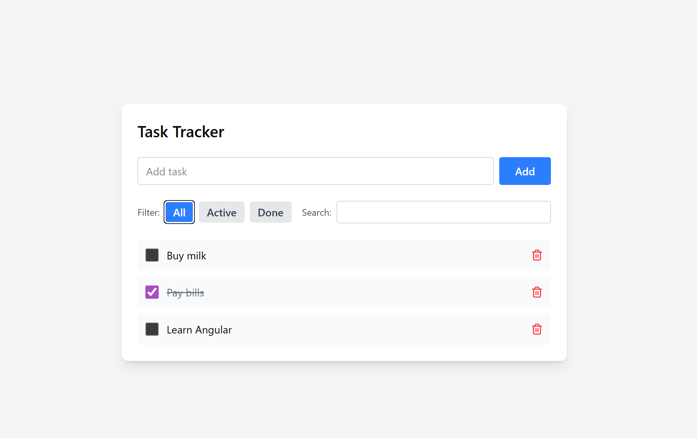

# Task.Tracker-Angular.Simple

## Мета
Навчитися робити базовий Angular застосунок "з нуля" на простому прикладі Task Tracker.

Фокус:
- компоненти
- data binding
- директиви
- pipes
- локальне збереження

## Фічі
- Список задач: додати / видалити / позначити виконаною
- Фільтри: `All` / `Active` / `Done`
- Пошук
- Збереження в `localStorage`

## Ключові теми
- Standalone компоненти
- `@Input` / `@Output`, події
- `@for`, `@if` (або `*ngFor`, `*ngIf`)
- `ngClass`
- Pipe (наприклад, підсвітка пошуку)
- Простий `TasksService` + `localStorage`

## План по кроках
1. Додавання задачі (форма + рендер списку).
2. Позначення задачі виконаною (`done`).
3. Видалення задачі.
4. Фільтри `All / Active / Done`.
5. Пошук по задачах.
6. Збереження та читання з `localStorage`.
7. Винесення логіки в `TasksService`.
8. Pipe для підсвітки тексту пошуку.

## Про цикл у шаблоні
- `while` у Angular-шаблоні майже не використовують.
- `@for` / `*ngFor` — це Angular-конструкція шаблону (не чистий HTML-цикл).

## Референс рендеру

## Де код
- Основний застосунок: [`TaskTracker/`](./TaskTracker)
- Додаткова документація про застосунок: [`TaskTracker/README.md`](./TaskTracker/README.md)
